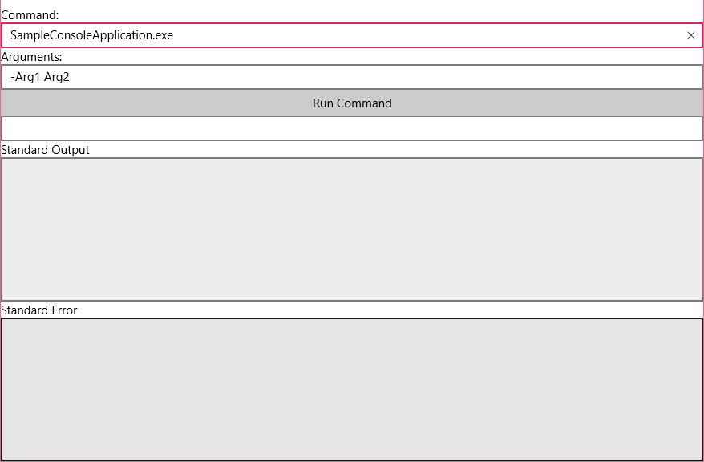
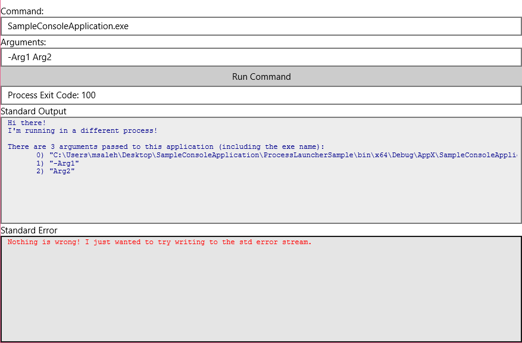
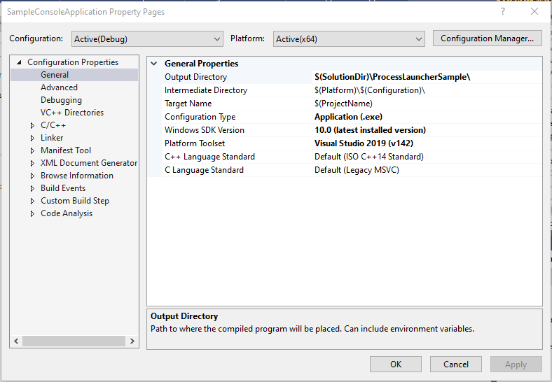
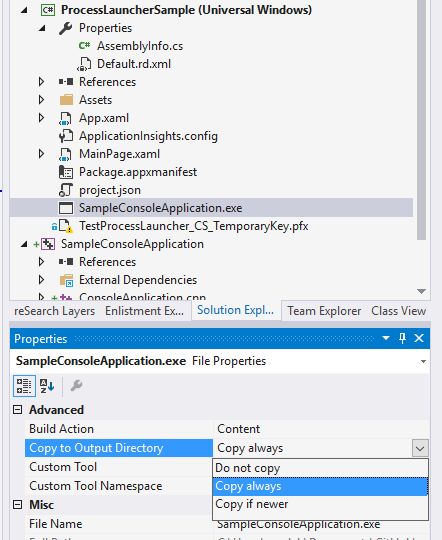
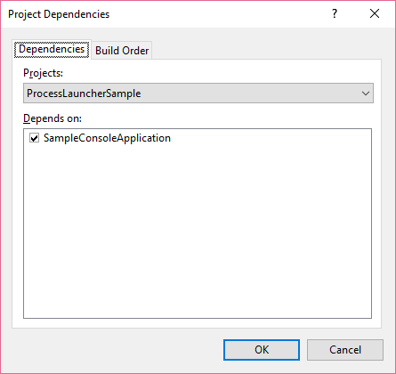
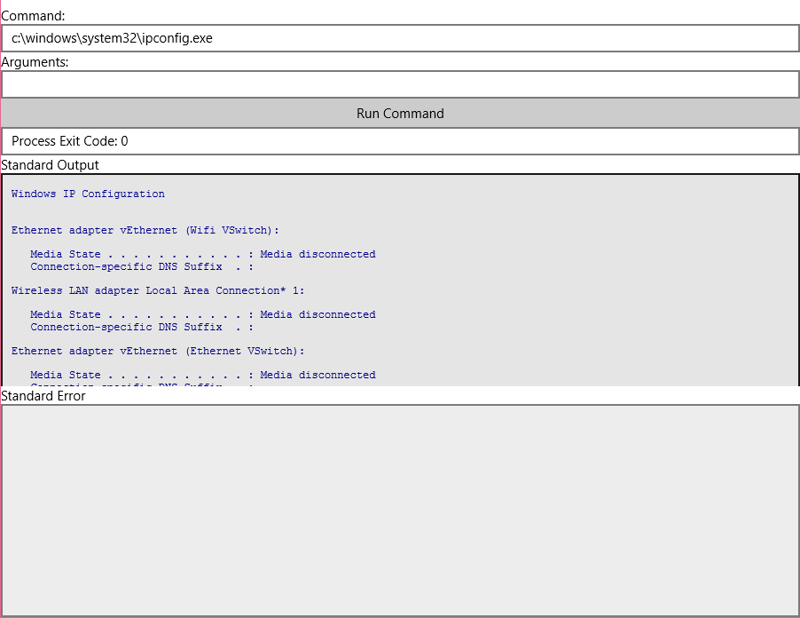

# External process launcher
  
We'll learn how to launch an external process (exe) from a Universal Windows Platform (UWP) app using `Windows.System.ProcessLauncher` API.  

### Load the project in Visual Studio  
  
You can find the source code for this sample by downloading a zip of all of our samples. Make a copy of the folder on your disk and open the project from Visual Studio 2019.  
  
This is a Universal Windows application. 

Make a copy of the folder on your disk and open the project from Visual Studio 2019.  

The code for the ProcessLauncher sample can be found under: <samples root folder>\ProcessLauncher\CS  
 
### Deploy your app  
 
For building on UP-Board, select `x64` as the architecture.

Select **Remote Machine** to point to IoT device and hit F5 to deploy to your device. 

### Generate an app package

Steps to follow :

 * In Solution Explorer, open the solution for your application project.

 * Right-click the project and choose Publish->Create App Packages (before Visual Studio 2019 version 16.3, the Publish menu is named Store).

 * Select Sideloading in the first page of the wizard and then click Next.

 * On the Select signing method page, select whether to skip packaging signing or select a certificate for signing. You can select a certificate from your local certificate store, select a certificate file, or create a new certificate. 

 * For an MSIX package to be installed on an end user's machine, it must be signed with a cert that is trusted on the machine.

 * Complete the Select and configure packages page as described in the Create your app package upload file using Visual Studio section.

 If you need guidance click Link: [here](https://docs.microsoft.com/en-us/windows/msix/package/packaging-uwp-apps#generate-an-app-package).  
  
### Install your app package using an install script

Steps to follow :

 * Open the *_Test folder.

 * Right-click on the Add-AppDevPackage.ps1 file. Choose Run with PowerShell and follow the prompts.

 * When the app package has been installed, the PowerShell window displays this message: Your app was successfully installed.

 If you need guidance click Link: [here](https://docs.microsoft.com/en-us/windows/msix/package/packaging-uwp-apps#install-your-app-package-using-an-install-script).  
  
 Click the Start button to search for the app by name, and then launch it.

### Test your app   
  
The sample app when deployed displays a screen similar to this one: 



Go ahead, click the **Run Command** button to launch the application specified in the **Command** edit box, SampleConsoleApplication.exe, which is an executable Win32 application built and deployed from the sample app as well.

When run, the SampleConsoleApplication exe, will send output to both the Standard Output and Standard Error boxes. The return error code of the process, 100, should also be shown.



## Let's take a look at the code  
 
The code for this sample makes use of the `Windows.System.ProcessLauncher` API, which is part of the system management contract APIs available on Windows IoT Enterprise.
 
To use the API, we need to do a couple of things.

### Add a reference to the Windows IoT extension SDK

Since the IoT extension SDK is not added to projects by default, we'll need to add a reference to it so its types, including `Windows.System.SystemManagement.ProcessLauncher`, will be available in the project.  

To do so, right-click on the References entry under the project, select "Add Reference" then navigate the resulting dialog to `Universal Windows->Extensions->Windows IoT Extensions for the UWP` making sure the right version, 10.0.10586.0 or higher, is selected, then check the box, and click OK.


### Add systemManagement capabiity

Accessing the `Windows.System.ProcessLauncher` API from your code requires the `systemManagement` IOT Capability. So, we need to add it to the AppX manifest, **Package.appxmanifest** file:

**NOTE:** While you can add other capabilities directly by double clicking and opening the **Package.appxmanifest** file in the UI editor, **systemManagement** capability can only be added via the XML editor (Right Click on the file -> Open with -> XML (Text) Editor) and adding the capability below:
 
``` xml  
<Package
  xmlns="http://schemas.microsoft.com/appx/manifest/foundation/windows10"
  xmlns:mp="http://schemas.microsoft.com/appx/2014/phone/manifest"
  xmlns:uap="http://schemas.microsoft.com/appx/manifest/uap/windows10"
  xmlns:iot="http://schemas.microsoft.com/appx/manifest/iot/windows10"
  IgnorableNamespaces="uap mp iot">


  <Capabilities>
    <Capability Name="internetClient" />
	<!-- Add the capability here -->
    <iot:Capability Name="systemManagement" />
  </Capabilities>
```  
 
### Launching a process

The `ProcessLauncher` API providers a number of static method overloads to launch new apps using the executable file name plus optional arguments and other options. 

Here's the part of the sample that launches the new process. After the process is launched, we `await` its return to get the exit code.

```csharp   
var result = await ProcessLauncher.RunToCompletionAsync(cmd.Text, args.Text == null ? string.Empty : args.Text, options);

ProcessExitCode.Text += "Process Exit Code: " + result.ExitCode;
``` 

### Using standard streams 

While the exit code is often enough to let us know if an executable has succeeded or not, sometimes we need to read the output from the program; e.g. to log information or to show that text in the app.

The `ProcessLauncherOptions` class allows sharing the standard input, output and error streams between the UWP app and external process.

* `ProcessLauncherOptions.StandardInput` is of type `Windows.Storage.Streams.IInputStream` and is **read from** by the external process
* Both `ProcessLauncherOptions.StandardOutput` and `ProcessLauncherOptions.StandardError` are `Windows.Storage.Streams.IInputStream` properties and are used by the external process to **write to** standard output or standard error

Now, let's learn how to pass output streams to the executable and then read what was written to it.

To be able to both read and write data to strams, we create the streams as `Windows.Storage.Streams.InMemoryRandomAccessStream` objects. `InMemoryRandomAccessStream` can be casted as both Input or Output streams, which is exactly what we need. We will pass it as `IOutputStream` to the `ProcessLauncherOptions`, and then read data from it as an `IInputStream` after the external exe has completed writing to it.

Here's the relavant code from the sample. First, we initialize the stream objects:

```csharp   
var options = new ProcessLauncherOptions();
var standardOutput = new InMemoryRandomAccessStream();
var standardError = new InMemoryRandomAccessStream();
options.StandardOutput = standardOutput;
options.StandardError = standardError;
``` 

Then, we pass the options to the `RunToCompletionAsync()` method:

```csharp   
var result = await ProcessLauncher.RunToCompletionAsync(cmd.Text, args.Text == null ? string.Empty : args.Text, options);
``` 

Finally, we read the data from the `InMemoryRandomAccessStream` after getting it as an input stream:

```csharp   
using (var outStreamRedirect = standardOutput.GetInputStreamAt(0))
{
    var size = standardOutput.Size;
    using (var dataReader = new DataReader(outStreamRedirect))
    {
        var bytesLoaded = await dataReader.LoadAsync((uint)size);
        var stringRead = dataReader.ReadString(bytesLoaded);
        StdOutputText.Text += stringRead;
    }
}
``` 

**Note**, while not used in the sample, the standard input stream can be used with the `ProcessLauncher` API as well.

### Including an executable application with the AppX package

The `ProcessLauncher` API can launch executable programs packaged as part of the same AppX. So, a sample Win32 console app, SampleConsoleApplication, is included in the sample.

The program itself is quite simple, but it demonstrates the various aspects of the ProcessLauncher API, including argument passing and sharing standard output and standard error streams.

Here's the main method of the sample console app:

``` c++  
int main(int argc, char **argv)
{
    std::cout << "Hi there!" << std::endl;
    std::cout << "I'm running in a different process!" << std::endl << std::endl;

    std::cout << "There are " << argc << " arguments passed to this application (including the exe name):" << std::endl;
    for (int i = 0; i < argc; i++)
    {
        std::cout << "\t" << i << ") \"" << argv[i] << "\"" << std::endl;
    }

    std::cerr << "Nothing is wrong! I just wanted to try writing to the std error stream." << std::endl;

    return 100;
}
```  

The application has been added to the solution as a *console application*. To create your own console application, please refer to the [Console Application Sample](/Samples/memorystatus).

To be able to find and invoke the SampleConsoleApplication exe at runtime, we need to package the output exe with the AppX. We've already added it to the sample application. However, to do the same in your own application, you can follow these steps:

1. Put the output exe in the same folder as the C# sample. Right click on the C++ console app project, select *Properties*, then open the *General* tab
1. Change the output directory to the be the same as the C# sample (or a subfolder) and click OK 
1. Build the console application to create and put the exe in its new location
1. Add the exe to the UWP projct: Right click on the Project, select *Add -> Existing Item*
1. Browse to and select the exe just built
1. After the exe is added to the UWP project, we need to make sure it's added to the AppX package layout, Right click on the exe, select *Properties*
1. Change *Build Action* to *Content*
1. Change *Copy to Output Directory* to *Always* 
1. Finaly, to ensure the exe is built every time the main app is deployed, we need to change the project dependency, Right click the solution, select *Project Dependencies* and make the UWP project have a dependency on the console app 

Now, everytime the solution is built or deployed, it'll ensure the console application exe is up-to-date and deployed with the rest of the AppX. 
  
## Run more executables

When a relative path is specified; such as *SampleConsoleApp.exe*, *.\SampleConsoleApp.exe* or a subfolder, *subfolder\SampleConsoleApp.exe*, the `ProcessLauncher` API looks for the exe file starting at the package root of the AppX deployed.

However, the API is also capable of running apps anywhere on the device, by specifying the absolute path; e.g. c:\windows.system32\ipconfig.exe

To use an external exe, that exe must be added to an **allow list**. This is needed to prevent malicious apps from running. 

To add an exe to the **allow list**, add to or replace the reg value in the reg command below:

`reg.exe ADD "HKLM\SOFTWARE\Microsoft\Windows\CurrentVersion\EmbeddedMode\ProcessLauncher" /v AllowedExecutableFilesList /t REG_MULTI_SZ /d "c:\windows\system32\ipconfig.exe\0c:\windows\system32\tlist.exe\0"`

**Note**, `ProcessLauncher` API launches executables under the current user credentials, or **DefautlAccount**, so apps requiring admin priviliges will fail to run properly.

Go ahead, run the command above on your device, using SSH or PowerShell. Then, in the sample app (no need to restart) type the command `c:\windows\system32\ipconfig.exe`. You should get an output similar to the one below:



