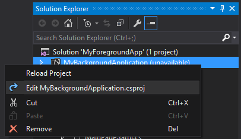
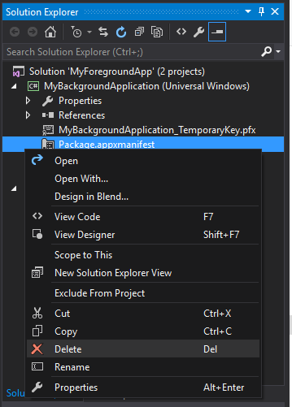

# Foreground App with Background App

These are the available versions of this Windows 10 IoT Enterprise sample.  

In both versions, the Background App currently toggles a GPIO pin. 

## About this sample
If you want to create a solution that builds the foreground application and the background application into the same .APPX file it will require manual steps to combine the two projects.

### Steps

1. File>New>Project…
2. Create a new Blank App

3. Select desired target version and click OK when prompted for target version

4.	In Solution Explorer right-click on the solution and choose Add>New Project …

5.	Create a new Background Application

6.	Select desired target version and click OK when prompted for target version

7.	In Solution Explorer right-click on the background application Package.appxmanifest and choose View Code

8.	In Solution Explorer right-click on the foreground application Package.appxmanifest and choose View Code

9.	At the top of the foreground Package.appxmanifest add xmlns:iot="http://schemas.microsoft.com/appx/manifest/iot/windows10" and modify IgnorableNamespaces to include iot.

        <Package
        xmlns="http://schemas.microsoft.com/appx/manifest/foundation/windows10"
        xmlns:mp="http://schemas.microsoft.com/appx/2014/phone/manifest"
        xmlns:uap="http://schemas.microsoft.com/appx/manifest/uap/windows10"
        xmlns:iot="http://schemas.microsoft.com/appx/manifest/iot/windows10"
        IgnorableNamespaces="uap mp iot">

10.	Copy the <Extensions> from the Background Application project Package.appxmanifest  to the Foreground Application Package.appxmanifest.  It should look like this:

        <Applications>
        <Application Id="App"
            Executable="$targetnametoken$.exe"
            EntryPoint="MyForegroundApp.App">
            <uap:VisualElements
            DisplayName="MyForegroundApp"
            Square150x150Logo="Assets\Square150x150Logo.png"
            Square44x44Logo="Assets\Square44x44Logo.png"
            Description="MyForegroundApp"
            BackgroundColor="transparent">
            <uap:DefaultTile Wide310x150Logo="Assets\Wide310x150Logo.png"/>
            <uap:SplashScreen Image="Assets\SplashScreen.png" />
            </uap:VisualElements>
            <Extensions>
            <Extension Category="windows.backgroundTasks" EntryPoint="MyBackgroundApplication.StartupTask">
                <BackgroundTasks>
                <iot:Task Type="startup" />
                </BackgroundTasks>
            </Extension>
            </Extensions>
        </Application>
        </Applications>

11.	In Solution Explorer right-click on the Foreground Application References node and choose Add Reference…

12.	Add a project reference to the Background Application
 

13.	In Solution Explorer right-click the foreground application project and choose Unload Project, then right-click the background application project and choose Unload Project.

14.	In Solution Explorer right-click on the foreground application project and choose Edit MyForegroundApp.csproj and then right-click on the background application project and choose Edit MyBackgroundApp.csproj.
 

15.	In the background project file comment the following lines:

        <!--<PackageCertificateKeyFile>MyBackgroundApplication_TemporaryKey.pfx</PackageCertificateKeyFile>-->
        <!--<AppxPackage>true</AppxPackage>-->
        <!--<ContainsStartupTask>true</ContainsStartupTask>-->

16.	In the foreground project file add <ContainsStartupTask>true</ ContainsStartupTask> to the first PropertyGroup

        <PropertyGroup>
            <!-- snip -->
            <PackageCertificateKeyFile>MyForegroundApp_TemporaryKey.pfx</PackageCertificateKeyFile>
            <ContainsStartupTask>true</ContainsStartupTask>
        </PropertyGroup>

17.	In Solution Explorer right-click on each project and choose Reload Project

18.	In Solution Explorer delete Package.appxmanifest from the background application

19.	At this point the project should build (and run the implementation you have added to the foreground and background applications).

### Generate an app package

Steps to follow :

 * In Solution Explorer, open the solution for your application project.
 * Right-click the project and choose Publish->Create App Packages (before Visual Studio 2019 version 16.3, the Publish menu is named Store).
 * Select Sideloading in the first page of the wizard and then click Next.
 * On the Select signing method page, select whether to skip packaging signing or select a certificate for signing. You can select a certificate from your local certificate store, select a certificate file, or create a new certificate. For an MSIX package to be installed on an end user's machine, it must be signed with a cert that is trusted on the machine.
 * Complete the Select and configure packages page as described in the Create your app package upload file using Visual Studio section.

 If you need guidance click Link: [here](https://docs.microsoft.com/en-us/windows/msix/package/packaging-uwp-apps#generate-an-app-package).  
  
### Install your app package using an install script

Steps to follow :
 * Open the *_Test folder.
 * Right-click on the Add-AppDevPackage.ps1 file. Choose Run with PowerShell and follow the prompts.
 * When the app package has been installed, the PowerShell window displays this message: Your app was successfully installed.

 If you need guidance click Link: [here](https://docs.microsoft.com/en-us/windows/msix/package/packaging-uwp-apps#install-your-app-package-using-an-install-script).  
  
 Click the Start button to search for the app by name, and then launch it.

 If you are using UPBOARD, you have to setup the BIOS GPIO configuration.

### BIOS Settings for UPBOARD

Steps to follow:
 
(1)	After power on the Upboard, Press Del or F7 to enter the BIOS setting.
 
(2)	Under the "Boot -> OS Image ID" Tab:
    Select "Windows 10 IoT Core".
 
(3)	Under the "Advance" Tab:
    Select "Hat Configuration" and Click on "GPIO Configuration in Pin Order".

(4) Configure the Pins you are using in the sample as "INPUT" or "OUTPUT".
   
    In this sample make Pin 15 as OUTPUT.

If you need guidance click Link: [here](https://www.annabooks.com/Articles/Articles_IoT10/Windows-10-IoT-UP-Board-BIOS-RHPROXY-Rev1.3.pdf).

## Note

Make sure that LowLevel Capabilities in set in PackageAppManifest.
* To do that go to Package.appxmanifesto and view the code
* Under Capabilities if you can find "DeviceCapability Name="lowLevel"/" then your lowLevel Capabilities is enabled.
* If this line "DeviceCapability Name="lowLevel"/" is not present then add it to enable the LowLevel mode and save the PackageAppManifest.
