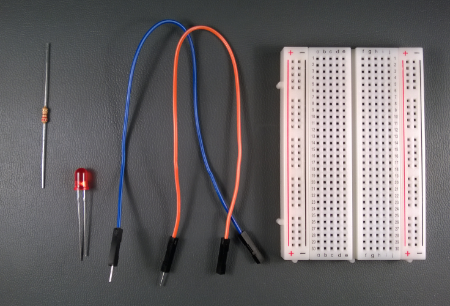
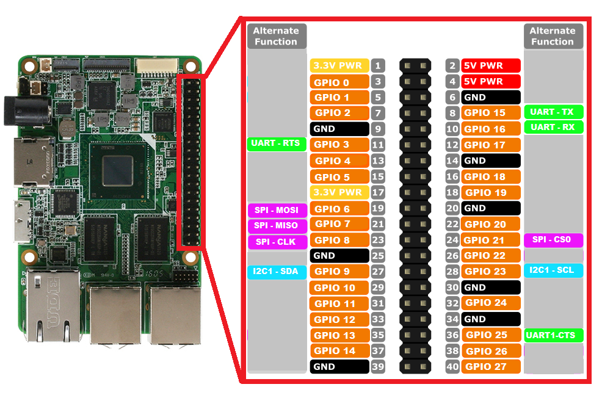

# “Hello, blinky!”

We’ll create a simple LED blinking app and connect a LED to your Windows 10 IoT Enterprise device.

Also, be aware that the GPIO APIs are only available on Windows 10 IoT Enterprise, so this sample cannot run on your desktop.

## Load the project in Visual Studio 2019

* * *

## Connect the LED to your Windows IoT device

* * *

You’ll need a few components:

*   a LED (any color you like)

*   a 220 Ω resistor for the UpBoard

*   a breadboard and a couple of connector wires

### For UpBoard

1.  Connect the shorter leg of the LED to GPIO 5 (pin 15 on the expansion header) on the UpBoard.
2.  Connect the longer leg of the LED to the resistor.
3.  Connect the other end of the resistor to one of the 3.3V pins on the UpBoard.
4.  Note that the polarity of the LED is important. (This configuration is commonly known as Active Low)

And here is the pinout of the UpBoard:

Here is an example of what your breadboard might look like with the circuit assembled:

## Deploy your app

* * *

With the application open in Visual Studio 2019, set the architecture in the toolbar dropdown. If you’re building for UpBaord, select `x64`.

### Generate an app package

Steps to follow :

 * In Solution Explorer, open the solution for your application project.
 * Right-click the project and choose Publish->Create App Packages (before Visual Studio 2019 version 16.3, the Publish menu is named Store).
 * Select Sideloading in the first page of the wizard and then click Next.
 * On the Select signing method page, select whether to skip packaging signing or select a certificate for signing. You can select a certificate from your local certificate store, select a certificate file, or create a new certificate. For an MSIX package to be installed on an end user's machine, it must be signed with a cert that is trusted on the machine.
 * Complete the Select and configure packages page as described in the Create your app package upload file using Visual Studio section.

 If you need guidance click Link: [here](https://docs.microsoft.com/en-us/windows/msix/package/packaging-uwp-apps#generate-an-app-package).  
  
### Install your app package using an install script

Steps to follow :
 * Open the *_Test folder.
 * Right-click on the Add-AppDevPackage.ps1 file. Choose Run with PowerShell and follow the prompts.
 * When the app package has been installed, the PowerShell window displays this message: Your app was successfully installed.

 If you need guidance click Link: [here](https://docs.microsoft.com/en-us/windows/msix/package/packaging-uwp-apps#install-your-app-package-using-an-install-script).  
 
If you are using UPBOARD, you have to setup the BIOS GPIO configuration.

### BIOS Settings for UPBOARD

Steps to follow:
 
(1)	After power on the Upboard, Press Del or F7 to enter the BIOS setting.
 
(2)	Under the "Boot -> OS Image ID" Tab:
    Select "Windows 10 IoT Core".
 
(3)	Under the "Advance" Tab:
    Select "Hat Configuration" and Click on "GPIO Configuration in Pin Order".

(4) Configure the Pins you are using in the sample as "INPUT" or "OUTPUT".

    In this sample make PIN 15 as "OUTPUT" and initial value as "HIGH".

If you need guidance click Link: [here](https://www.annabooks.com/Articles/Articles_IoT10/Windows-10-IoT-UP-Board-BIOS-RHPROXY-Rev1.3.pdf).
 
 Click the Start button to search for the app by name, and then launch it.

The Blinky app will deploy and start on the Windows IoT device, and you should see the LED blink in sync with the simulation on the screen.

Congratulations! You controlled one of the GPIO pins on your Windows IoT device.

## Let’s look at the code

* * *

The code for this sample is pretty simple. We use a timer, and each time the ‘Tick’ event is called, we flip the state of the LED.

### Timer code

Here is how you set up the timer in C#:

	public MainPage()
	{
		// ...

		timer = new DispatcherTimer();
		timer.Interval = TimeSpan.FromMilliseconds(500);
		timer.Tick += Timer_Tick;
		InitGPIO();
		if (pin != null)
		{
			timer.Start();
		}

		// ...
	}

	private void Timer_Tick(object sender, object e)
	{
		if (pinValue == GpioPinValue.High)
		{
			pinValue = GpioPinValue.Low;
			pin.Write(pinValue);
			LED.Fill = redBrush;
		}
		else
		{
			pinValue = GpioPinValue.High;
			pin.Write(pinValue);
			LED.Fill = grayBrush;
		}
	}

### Initialize the GPIO pin

To drive the GPIO pin, first we need to initialize it. Here is the C# code (notice how we leverage the new WinRT classes in the Windows.Devices.Gpio namespace):

	using Windows.Devices.Gpio;

	private void InitGPIO()
	{
		var gpio = GpioController.GetDefault();

		// Show an error if there is no GPIO controller
		if (gpio == null)
		{
			pin = null;
			GpioStatus.Text = "There is no GPIO controller on this device.";
			return;
		}

		pin = gpio.OpenPin(LED_PIN);
		pinValue = GpioPinValue.High;
		pin.Write(pinValue);
		pin.SetDriveMode(GpioPinDriveMode.Output);

		GpioStatus.Text = "GPIO pin initialized correctly.";

	}

Let’s break this down a little:

*   First, we use `GpioController.GetDefault()` to get the GPIO controller.

*   If the device does not have a GPIO controller, this function will return `null`.

*   Then we attempt to open the pin by calling `GpioController.OpenPin()` with the `LED_PIN` value.

*   Once we have the `pin`, we set it to be off (High) by default using the `GpioPin.Write()` function.

*   We also set the `pin` to run in output mode using the `GpioPin.SetDriveMode()` function.

### Modify the state of the GPIO pin

Once we have access to the `GpioOutputPin` instance, it’s trivial to change the state of the pin to turn the LED on or off.

To turn the LED on, simply write the value `GpioPinValue.Low` to the pin:

	pin.Write(GpioPinValue.Low);

and of course, write `GpioPinValue.High` to turn the LED off:

	pin.Write(GpioPinValue.High);

Remember that we connected the other end of the LED to the 3.3 Volts power supply, so we need to drive the pin to low to have current flow into the LED.

## Additional resources

* [Documentation for all samples](https://developer.microsoft.com/en-us/windows/iot/samples)

This project has adopted the Microsoft Open Source Code of Conduct. For more information see the Code of Conduct FAQ or contact <opencode@microsoft.com> with any additional questions or comments.
