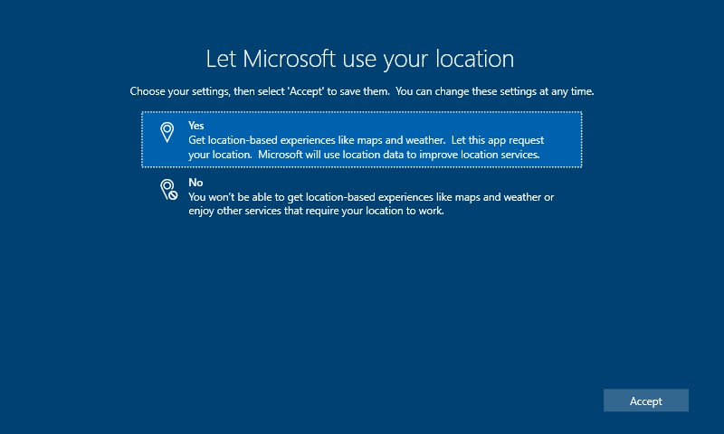
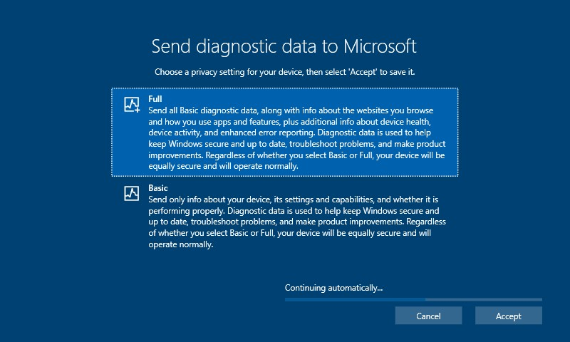

# Windows 10 IoT Enterprise Default App Overview

When you initially flash this sample, you will be presented with the Windows 10 IoT Enterprise Default App, which looks like this:

The purpose of this application is not only to provide you with a friendly shell to interact with when you first boot up Windows 10 IoT Enterprise, but we have open-sourced the code for this application sample, so that you can plug and play with these features on your own custom application(s).

This article will give you a rundown of the different features that the Windows 10 IoT Enterprise Default App offers as well as how you can leverage these different features for your own applications.

## Leveraging the IoT Enterprise Default App 

The IoT Enterprise Default App can be customized and extended, or you can use the source code as an example for your own app. 

To try this out for yourself, download the zip of our samples or check out the code for the IoT Enterprise Default App. Open the project from Visual Studio 2019, 

For UpBoard, set the target architecture to 'x64'.

### Generate an app package

Steps to follow :

 * In Solution Explorer, open the solution for your application project.
 * Right-click the project and choose Publish->Create App Packages (before Visual Studio 2019 version 16.3, the Publish menu is named Store).
 * Select Sideloading in the first page of the wizard and then click Next.
 * On the Select signing method page, select whether to skip packaging signing or select a certificate for signing. You can select a certificate from your local certificate store, select a certificate file, or create a new certificate. For an MSIX package to be installed on an end user's machine, it must be signed with a cert that is trusted on the machine.
 * Complete the Select and configure packages page as described in the Create your app package upload file using Visual Studio section.

 If you need guidance click Link: [here](https://docs.microsoft.com/en-us/windows/msix/package/packaging-uwp-apps#generate-an-app-package).  
  
### Install your app package using an install script

Steps to follow :
 * Open the *_Test folder.
 * Right-click on the Add-AppDevPackage.ps1 file. Choose Run with PowerShell and follow the prompts.
 * When the app package has been installed, the PowerShell window displays this message: Your app was successfully installed.

 If you need guidance click Link: [here](https://docs.microsoft.com/en-us/windows/msix/package/packaging-uwp-apps#install-your-app-package-using-an-install-script).  
  
 Click the Start button to search for the app by name, and then launch it.

As shown below, in some cases you may configure default settings and features on your customer system on behalf of the end user. However, if you turn these settings and features on by default or if diagnostics are above the basic setting, you must:

* Notify the end user that these features have been enable and provide the end user with the link to Microsoft's Privacy Statement web page [here](http://go.microsoft.com/fwlink/?LinkId=521839). 
* Secure consent from the relevant end user to enable such features by default (as required by applicable law).
* Provide end users the ability to change the Diagnostics setting back to the basic setting.
* If you enable Microsoft Accounts and you have access to end user data, if the end user deletes the Microsoft Account, you must enable simultaneous deletion of all the end user's Microsoft Account data on the device. 

## Out-of-Box Experience (OOBE)

The out-of-box experience for the IoT Enterprise Default App is as lean as it gets. The first pages will ask for a default language and wi-fi settings. From there, in order for your app to be GDPR-compliant, you must have a diagnostic data screen and, if you're planning to track location, you will need to have a location permissions screen too. Examples of both are shown below. 

## Command Bar
The Command Bar is the persistant horizonatal bar located at the bottom of the screen. This provides easy access to the following funtionality:
- Forward and backward page navigation
- Basic device info without leaving the current page
- Turning fullscreen mode on or off
- Advance shortcuts
- Page specific buttons

There are a lot buttons in the Command Bar, and sometimes those buttons can be confusing or hidden. To expand the Command Bar and access those buttons, please press the menu button in the bottom right:

## Start Menu - Play

The Start Menu is where most plug and play features live.

### Weather
Using data from the National Weather Service, the weather page renders weather information in your current location.

### Web Browser
The web browser allows you to pull up most sites from the web.

### Music
This page will play MP3 and WAV files from the **Music Library**, that can be accessed from the web

### Slideshow
This page will display any PNG or JPEG image files from the **Pictures Library**, that can be accessed from the web

### Draw
This page allows you to test out Windows 10 IoT Enterprise's inking capabilities.

## Start Menu - Explore 

### Apps 
This page allows you to launch other foreground applications installed on the device. Launching an application will suspend IoT Enterprise Default App, which can be relaunched by using App Packages.

Nothing special is needed to have your foreground application listed in the page, simply install or deploy the application. After successful installation or deployment, re-navigate to the Apps page to refresh the list of applications.

Note that there are a couple of auto-generated OS related applications that we filter out, you can find the list of app names in the samples.

### Notifications
This page will list the past 20 notifications since IoT Enterprise Default App was launched. When IoT Enterprise Default App is running in debug mode, buttons are added that will create test notifications.

### Logs
This page will list any auto-generated crash or error logs, which then can be taken off the device and analyzed.

### GitHub
This page will take you to the open-sourced GitHub location of the IoT Enterprise Default App code.

## Start Menu - Windows Device Portal

The pages in this section leverage the Windows Device Portal REST APIs, which requires you to sign in using your Windows Device Portal credentials.

## Device Information

This page allows you to see the different features for your device including Ethernet, OS version, connected devices, and more.

## Command Line

This page allows you to run commands directly on your device.

To enable this feature you have to set a registry key so that the app can run the commands.

Some commands require administrator access. For security purposes the app uses a non-admin account by default to run commands. If you need to run a command as an admin you can type "RunAsAdmin <your command>" in the command line prompt.

## Settings
You'll be able to configure a number of settings here including Wi-Fi, Bluetooth, power options, and more.

### App Settings
The **App Settings** section allows you to configure various settings for pages in the app.  

Some of the settings you can customize are:

##### Weather Settings
* Change the location
  > This feature is only enabled if you have provided a valid [Bing Map Service Token](https://msdn.microsoft.com/en-us/library/ff428642.aspx).  To pass the token to the app, create a **MapToken.config** file in the LocalState folder of the app (e.g. C:\Data\USERS\\[User Account]\AppData\Packages\\[Package Full Name]\LocalState\MapToken.config) and restart the app.
* Expand the map
* Enable/disable map flipping so that the map and the weather switch places periodically to prevent screen burn-in

##### Web Browser Settings
* Set the home page for the Web Browser

##### Slideshow Settings
* Set the slideshow interval

##### Appearance
* Use MDL2 Assets instead of Emojis for the tile icons
* Set the tile width and height
* Set UI scaling - Automatic scaling is set by default
* Set the tile color

#### System
Change the language, keyboard layout, and time zone.

#### Network & Wi-Fi
View network adapter properties or connect to an available Wi-Fi network.

#### Bluetooth
Pair with a Bluetooth device.

#### App Updates
Check for app updates or change automatic update settings.

#### Power Options
Restart or shutdown the device.

#### Diagnostics
Select the amount of diagnostic data you wish to provide Microsoft.  We encourage users to opt into **Full** diagnostic data so we can diagnose issues quickly and make improvements to the product.

##### Basic 
Send only info about your device, its settings and capabilities, and whether it is performing properly.

##### Full
Send all Basic diagnostic data, along with info about websites you browse and how you use apps and features, plus additional info about device health, device activity, and enhanced error reporting.

#### Location
Allow or deny the app access to your location.
