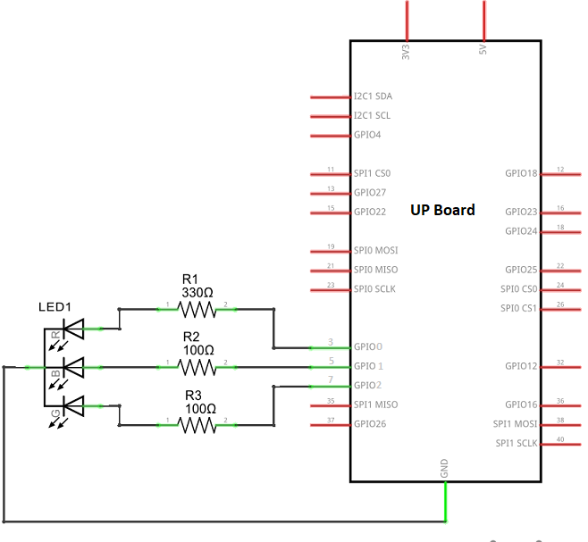
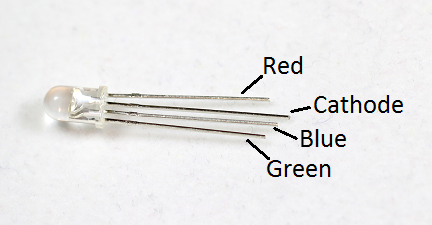

# RGB LED Sample

In this sample, we will connect a Tri-color LED to UpBoard. The LED will blink changing colors from Red, Blue, and Green.

Also, be aware that the GPIO APIs are only available on Windows IoT Enterprise Board, so this sample cannot run on your desktop.


### Components

You will need the following components :

* a [754-1615-ND Tri-color LED](http://www.digikey.com/product-detail/en/WP154A4SUREQBFZGC/754-1615-ND/3084119)

* a [330 &#x2126; resistor](http://www.digikey.com/product-detail/en/CFR-25JB-52-330R/330QBK-ND/1636)

* 2x [100 &#x2126; resistors](http://www.digikey.com/product-detail/en/CFR-25JB-52-100R/100QBK-ND/246)

* a breadboard and several male-to-female and male-to-male connector wires

### Connect to your Device

Let's start by wiring up the components on the breadboard as shown in the diagram below.


Here is the schematic:



The pinout of the Tri-color LED is shown below and can be found in the [datasheet](http://www.kingbrightusa.com/images/catalog/SPEC/WP154A4SUREQBFZGC.pdf)



#### Connecting the Tri-color LED

* Insert the Tri-color LED into the breadboard as shown in the breadboard diagram at the top of the page.

* Connect one end of the 330 &#x2126; resistor to the red lead of the Tri-color LED.

* Connect the other end of the 330 &#x2126; resistor to Pin 3 GPIO0 of the UpBoard.

* Connect one end of a 100 &#x2126; resistor to the blue lead of the Tri-color LED.

* Connect the other end of the 100 &#x2126; resistor to Pin 5 GPIO1 of the UpBoard.

* Connect one end of a 100 &#x2126; resistor to the green lead of the Tri-color LED.

* Connect the other end of the 100 &#x2126; resistor to Pin 7 GPIO2 of the UpBoard.

* Connect the cathode (the longest leg) of the Tri-color LED to Pin 6 GND.

Here is the pinout of the UpBoard:


### Deploy your app

You can find the source code for this sample by downloading a zip of all of our samples. Make a copy of the folder on your disk and open the project from Visual Studio 2019.  
  
This is a Universal Windows application 

### Generate an app package

Steps to follow :

 * In Solution Explorer, open the solution for your application project.
 * Right-click the project and choose Publish->Create App Packages (before Visual Studio 2019 version 16.3, the Publish menu is named Store).
 * Select Sideloading in the first page of the wizard and then click Next.
 * On the Select signing method page, select whether to skip packaging signing or select a certificate for signing. You can select a certificate from your local certificate store, select a certificate file, or create a new certificate. For an MSIX package to be installed on an end user's machine, it must be signed with a cert that is trusted on the machine.
 * Complete the Select and configure packages page as described in the Create your app package upload file using Visual Studio section.

 If you need guidance click Link: [here](https://docs.microsoft.com/en-us/windows/msix/package/packaging-uwp-apps#generate-an-app-package).  
  
### Install your app package using an install script

Steps to follow :
 * Open the *_Test folder.
 * Right-click on the Add-AppDevPackage.ps1 file. Choose Run with PowerShell and follow the prompts.
 * When the app package has been installed, the PowerShell window displays this message: Your app was successfully installed.

 If you need guidance click Link: [here](https://docs.microsoft.com/en-us/windows/msix/package/packaging-uwp-apps#install-your-app-package-using-an-install-script).  
  
 Click the Start button to search for the app by name, and then launch it.

If you are using UPBOARD, you have to setup the BIOS GPIO configuration.

### BIOS Settings for UPBOARD

Steps to follow:
 
(1)	After power on the Upboard, Press Del or F7 to enter the BIOS setting.
 
(2)	Under the "Boot -> OS Image ID" Tab:
    Select "Windows 10 IoT Core".
 
(3)	Under the "Advance" Tab:
    Select "Hat Configuration" and Click on "GPIO Configuration in Pin Order".

(4) Configure the Pins you are using in the sample as "INPUT" or "OUTPUT".

    In this sample make PIN 3, 5, 7 as "OUTPUT" and initial value as "LOW".

If you need guidance click Link: [here](https://www.annabooks.com/Articles/Articles_IoT10/Windows-10-IoT-UP-Board-BIOS-RHPROXY-Rev1.3.pdf).
 
### Let's look at the code

First, we get the default GPIO controller and check that it's not null.
`GpioController.GetDefault()` will return null on platforms that do not contain
a GPIO controller.

```csharp
private void Page_Loaded(object sender, RoutedEventArgs e)
{
    var gpio = GpioController.GetDefault();

    // Show an error if there is no GPIO controller
    if (gpio == null)
    {
        GpioStatus.Text = "There is no GPIO controller on this device.";
        return;
    }
}
```

If you are running on raspberry pi uncomment below block of code in MainPage.xaml.cs

```csharp
            /*if (deviceModel == DeviceModel.RaspberryPi2)
            {
                // Use pin numbers compatible with documentation
                const int RPI2_RED_LED_PIN = 5;
                const int RPI2_GREEN_LED_PIN = 13;
                const int RPI2_BLUE_LED_PIN = 6;

                redpin = gpio.OpenPin(RPI2_RED_LED_PIN);
                greenpin = gpio.OpenPin(RPI2_GREEN_LED_PIN);
                bluepin = gpio.OpenPin(RPI2_BLUE_LED_PIN);
            }
            else*/
```
 
If you are using DragonBoard uncomment below block of code in MainPage.xaml.cs

```csharp
                    /*switch (deviceModel)
                    {
                        case DeviceModel.DragonBoard410:
                            if (pinNumber == 21 || pinNumber == 120)
                                continue;
                            break;
                    }*/
```

If we're running on
UpBoard, we take the first 3 available pins. There is also logic to skip
pins connected to onboard functions on known hardware platforms.

```csharp
var deviceModel = GetDeviceModel();

    // take the first 3 available GPIO pins
    var pins = new List<GpioPin>(3);
    for (int pinNumber = 0; pinNumber < gpio.PinCount; pinNumber++)
    {
        // ignore pins used for onboard LEDs
        switch (deviceModel)
        {
            case DeviceModel.DragonBoard410:
                if (pinNumber == 21 || pinNumber == 120)
                    continue;
                break;
        }

        GpioPin pin;
        GpioOpenStatus status;
        if (gpio.TryOpenPin(pinNumber, GpioSharingMode.Exclusive, out pin, out status))
        {
            pins.Add(pin);
            if (pins.Count == 3)
            {
                break;
            }
        }
    }

    if (pins.Count != 3)
    {
        GpioStatus.Text = "Could not find 3 available pins. This sample requires 3 GPIO pins.";
        return;
    }

    redpin = pins[0];
    greenpin = pins[1];
    bluepin = pins[2];
```

Next, we initialize the pins as outputs driven LOW, which causes the LED
to be OFF. We also display which pin numbers are in use. If you're
using UpBoard, hook up the RGB LED to the pins shown on the display.

```csharp
redpin.Write(GpioPinValue.High);
redpin.SetDriveMode(GpioPinDriveMode.Output);
greenpin.Write(GpioPinValue.High);
greenpin.SetDriveMode(GpioPinDriveMode.Output);
bluepin.Write(GpioPinValue.High);
bluepin.SetDriveMode(GpioPinDriveMode.Output);

GpioStatus.Text = $"Red Pin = {redpin.PinNumber}, Green Pin = {greenpin.PinNumber}, Blue Pin = {bluepin.PinNumber}";
```

Finally, we start a periodic timer which we will use to rotate through the colors
of the LED. We use a `DispatcherTimer` because we'll be updating the UI
on the timer callback. If we did not need to update the UI, it would be better
to use a `System.Threading.Timer` which runs on a separate thread. The less we
can do on the UI thread, the more responsive the UI will be.

```csharp
timer = new DispatcherTimer();
timer.Interval = TimeSpan.FromMilliseconds(500);
timer.Tick += Timer_Tick;
timer.Start();
```

In the timer callback, we light up the currently active LED and update the UI.

```csharp
private void FlipLED()
{
    Debug.Assert(redpin != null && bluepin != null && greenpin != null);

    switch (ledStatus)
    {
        case LedStatus.Red:
            //turn on red
            redpin.Write(GpioPinValue.High);
            bluepin.Write(GpioPinValue.Low);
            greenpin.Write(GpioPinValue.Low);

            LED.Fill = redBrush;
            ledStatus = LedStatus.Green;    // go to next state
            break;
        case LedStatus.Green:

            //turn on green
            redpin.Write(GpioPinValue.Low);
            greenpin.Write(GpioPinValue.High);
            bluepin.Write(GpioPinValue.Low);

            LED.Fill = greenBrush;
            ledStatus = LedStatus.Blue;     // go to next state
            break;
        case LedStatus.Blue:
            //turn on blue
            redpin.Write(GpioPinValue.Low);
            greenpin.Write(GpioPinValue.Low);
            bluepin.Write(GpioPinValue.High);

            LED.Fill = blueBrush;
            ledStatus = LedStatus.Red;      // go to next state
            break;
    }
}

private void Timer_Tick(object sender, object e)
{
    FlipLED();
}
```
