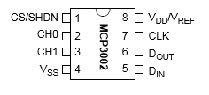
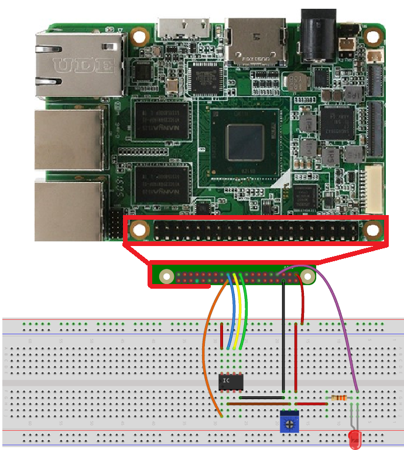
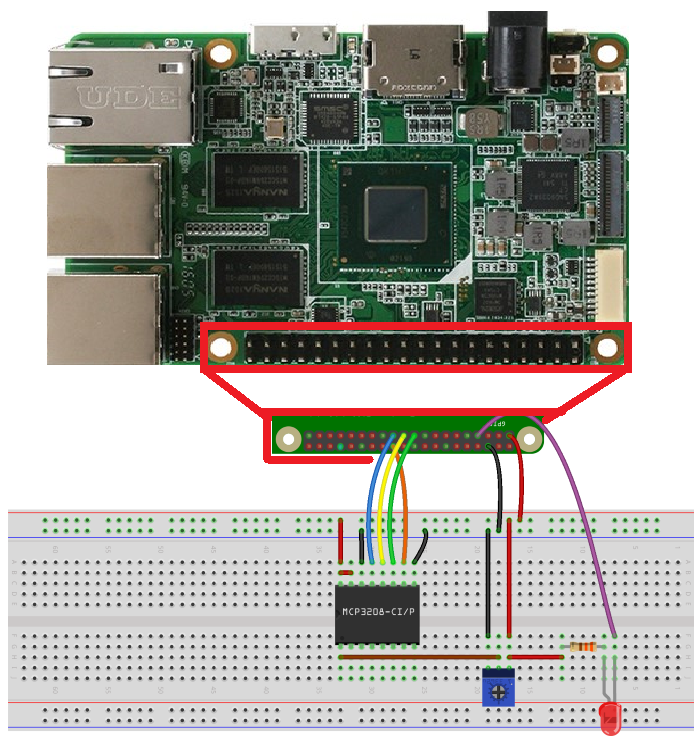
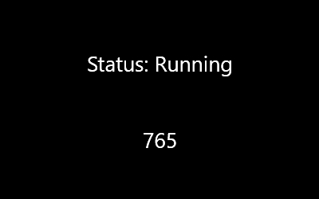
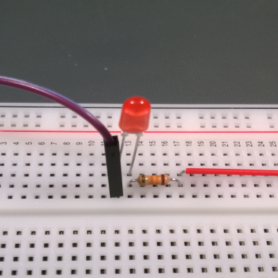
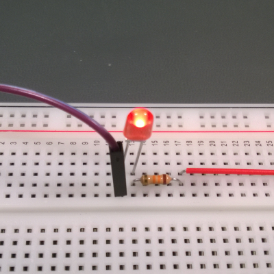

# Potentiometer sensor

This sample shows how to connect a rotary potentiometer and LED to a Windows 10 IoT Enterprise compatible device (this sample uses an UP Board). We use a SPI-based ADC (Analog to Digital Converter) to read values from the potentiometer and control an LED based on the knob position.

## Parts needed
- [1 LED](http://www.digikey.com/product-detail/en/C5SMF-RJS-CT0W0BB1/C5SMF-RJS-CT0W0BB1-ND/2341832)
- [1 330 &#x2126; resistor](http://www.digikey.com/product-detail/en/CFR-25JB-52-330R/330QBK-ND/1636)
- ADC
    - UP Board
        - [1 MCP3008 10-bit ADC](http://www.microchip.com/wwwproducts/Devices.aspx?dDocName=en010530) or [1 MCP3208 12-bit ADC](http://www.digikey.com/product-search/en?KeyWords=mcp3208%20ci%2Fp&WT.z_header=search_go)
        - [1 Voltage-Level Translator Breakout](https://www.sparkfun.com/products/11771)
- [1 10k &#x2126; Trimmer Potentiometer](http://www.digikey.com/product-detail/en/3362P-1-103TLF/3362P-103TLF-ND/1232540)
- UP Board
- 1 breadboard and a couple of wires
- HDMI Monitor and HDMI cable

## Parts Review

In this sample, you have the option of using either the MCP3002 or MCP3208 ADC (Analog to Digital Converter). 
The differences between the chips are the number of input channels and resolution. 12-bit resolution is more accurate than the 10-bit options, and the number of channels determines how many different inputs you can read.

Below are the pinouts of the MCP3002 and MCP3208 ADCs. 

| MCP3002                                                              | MCP3008 or MCP3208                                                              |
| -------------------------------------------------------------------- | -------------------------------------------------------------------- |
|  |  |


#### UP Board Pinout


#### Wiring & Connections

##### MCP3002
If you chose to use the **MCP3002**, assemble the circuit as follows. Note that the wiper pin (the middle pin on the 10k potentiometer) should be connected to `CH0` on MCP3002. You can also refer to the [datasheet](http://ww1.microchip.com/downloads/en/DeviceDoc/21294E.pdf) for more information.

Detailed connection:



The MCP3002 should be connected as follows:

- MCP3002: VDD/VREF - 3.3V on UP BOARD
- MCP3002: CLK - "SPI CLK" on UP BOARD
- MCP3002: Dout - "SPI MISO" on UP BOARD
- MCP3002: Din - "SPI MOSI" on UP BOARD
- MCP3002: CS/SHDN - "SPI CS0" on UP BOARD
- MCP3002: Vss - GND on UP BOARD
- MCP3002: CH0 - Potentiometer wiper pin


##### MCP3208 or MCP3008
If you chose to use the **MCP3208** or **MCP3008**, assemble the circuit as follows. Note that the wiper pin (the middle pin on the 10k potentiometer) should be connected to `CH0` on MCP3208. You can also refer to the [MCP3208 datasheet](http://pdf.datasheetcatalog.com/datasheets2/43/435228_1.pdf) or the [MCP3008 datasheet](http://ww1.microchip.com/downloads/en/DeviceDoc/21295C.pdf) for more information.

Detailed connection:



The MCP3208 should be connected as follows:

- MCP3208: VDD - 3.3V on UP BOARD
- MCP3208: VREF - 3.3V on UP BOARD
- MCP3208: AGND - GND on UP BOARD
- MCP3208: CLK - "SPI CLK" on UP BOARD
- MCP3208: Dout - "SPI MISO" on UP BOARD
- MCP3208: Din - "SPI MOSI" on U PBOARD
- MCP3208: CS/SHDN - "SPI CS0" on UP BOARD
- MCP3208: DGND - GND on UP BOARD
- MCP3208: CH0 - Potentiometer wiper pin


Finally, the LED_PIN variable of the **MainPage.xaml.cs** file of the sample code will need the following modification:

~~~
private const int LED_PIN = 0;
~~~
{: .language-c#}

##### MCP3008
If you chose to use the **MCP3008**, you can switch the MCP3208 for the MCP3008 in the above diagram.

### Building and running the sample

1. You can find the source code for this sample by downloading a zip of all of our samples. Make a copy of the folder on your disk and open the project from Visual Studio 2019.

1. [Generate an app package](https://docs.microsoft.com/windows/msix/package/packaging-uwp-apps#generate-an-app-package)

1. [Install your app package using an install script](https://docs.microsoft.com/windows/msix/package/packaging-uwp-apps#install-your-app-package-using-an-install-script)

1. If you are using UP Board, you have to setup the BIOS GPIO configuration.

    1. Once you power on the UP board, select the **Del** or **F7** key on your keyboard to enter the BIOS setting.

    1. Navigate to **Boot** > **OS Image ID** tab, and select **Windows 10 IoT Core**.

    1. Navigate to the **Advance** tab and select the **Hat Configuration** and select **GPIO Configuration in Pin Order**.

    1. Configure the Pins you are using in the sample as **INPUT** or **OUTPUT**.

    1. For more information, please review the [UP Board Firmware Settings.](https://www.annabooks.com/Articles/Articles_IoT10/Windows-10-IoT-UP-Board-BIOS-RHPROXY-Rev1.3.pdf)
 
 
1. When you turn the potentiometer knob, you will see the number change on the screen indicating the potentiometer knob position. 

1. When the number is larger than half the ADC resolution (For **MCP3002**, this number is **512**. For **MCP3008** or **MCP3208**, it's **4096**) the LED will turn ON. Otherwise, it turns OFF.

| ----------------------------------------------------------------------------------------- |-| ----------------------------------------------------------------
|        | |   |
|         | |    |

## Let's look at the code

The code here performs two main tasks:

1. First the code initializes the SPI bus and LED GPIO pin.

2. Secondly, we read from the ADC at defined intervals and update the display accordingly.

Let's start by digging into the initializations. The first thing we initialize is the GPIO LED pin in **InitGPIO()**.

```csharp
private void InitGpio()
{
	var gpio = GpioController.GetDefault();

	/* Show an error if there is no GPIO controller */
	if (gpio == null)
	{
		throw new Exception("There is no GPIO controller on this device");
	}

	ledPin = gpio.OpenPin(LED_PIN);

	/* GPIO state is initially undefined, so we assign a default value before enabling as output */
	ledPin.Write(GpioPinValue.High);        
	ledPin.SetDriveMode(GpioPinDriveMode.Output);
}
```

* We start by retrieving the default GPIO controller on the device with the **GpioController.GetDefault()** function.

* Since we connected the LED to GPIO 0, we open this pin on the GPIO controller.

* Finally we write a default value to the pin before setting it as output.

Next, we initialize the SPI bus. This allows the UP Board to communicate with the ADC to read in potentiometer positions.

```csharp
private async Task InitSPI()
{
	try
	{
		var settings = new SpiConnectionSettings(SPI_CHIP_SELECT_LINE);
		settings.ClockFrequency = 1000000;   /* 1MHz clock rate                                        */
		settings.Mode = SpiMode.Mode0;      /* The ADC expects idle-low clock polarity so we use Mode0  */

		string spiAqs = SpiDevice.GetDeviceSelector(SPI_CONTROLLER_NAME);
		var deviceInfo = await DeviceInformation.FindAllAsync(spiAqs);
		SpiADC = await SpiDevice.FromIdAsync(deviceInfo[0].Id, settings);
	}

	/* If initialization fails, display the exception and stop running */
	catch (Exception ex)
	{
		throw new Exception("SPI Initialization Failed", ex);
	}
}
```

* We start by specifying some configuration settings for our SPI bus:
1. We specify which chip select line we want to use. We wired the ADC into chip select line 0, so that's what we use here.
2. The clock frequency is conservatively set to 1MHz, which is well within the ADC capabilities.
3. **settings.Mode** is set to **SpiMode.Mode**. This configures clock polarity and phase for the bus.

* Next, we get the class selection string for our SPI controller. This controller controls the SPI lines on the exposed pin header. We then use the selection string to get the SPI bus controller matching our string name.

* Finally, we create a new **SpiDevice** with the settings and bus controller obtained previously.

After the initializations are complete, we create a periodic timer to read data every 100mS.

```csharp
private async void InitAll()
{
	// ...

	/* Now that everything is initialized, create a timer so we read data every 500mS */
	periodicTimer = new Timer(this.Timer_Tick, null, 0, 100);

	StatusText.Text = "Status: Running";
}
```

This timer calls the **Timer_Tick()** function. Which starts by reading from the ADC:

```csharp
public void ReadADC()
{
	byte[] readBuffer = new byte[3]; /* Buffer to hold read data*/
	byte[] writeBuffer = new byte[3] { 0x00, 0x00, 0x00 };

	/* Setup the appropriate ADC configuration byte */
	switch (ADC_DEVICE)
	{
		case AdcDevice.MCP3002:
			writeBuffer[0] = MCP3002_CONFIG;
			break;
		case AdcDevice.MCP3208:
			writeBuffer[0] = MCP3208_CONFIG;
			break;
	}

	SpiADC.TransferFullDuplex(writeBuffer, readBuffer); /* Read data from the ADC                           */
	adcValue = convertToInt(readBuffer);                /* Convert the returned bytes into an integer value */

	/* UI updates must be invoked on the UI thread */
	var task = this.Dispatcher.RunAsync(Windows.UI.Core.CoreDispatcherPriority.Normal, () =>
	{
		textPlaceHolder.Text = adcValue.ToString();         /* Display the value on screen                      */
	});
}
```

* We first setup the **writeBuffer** with some configuration data to send to the ADC

* Next we call **SpiADC.TransferFullDuplex()** to write the configuration data and read back the ADC results

* Inside the **convertToInt()** function, we convert the returned byte array into a integer

* Finally, we update the UI with the ADC result

Next, we control the LED based on the ADC result

```csharp
/* Turn on/off the LED depending on the potentiometer position    */
private void LightLED()
{
	int adcResolution = 0;

	switch (ADC_DEVICE)
	{
		case AdcDevice.MCP3002:
			adcResolution = 1024;
			break;
		case AdcDevice.MCP3208:
			adcResolution = 4096;
			break;
	}

	/* Turn on LED if pot is rotated more halfway through its range */
	if (adcValue > adcResolution / 2)
	{
		ledPin.Write(GpioPinValue.Low);
	}
	/* Otherwise turn it off                                        */
	else
	{
		ledPin.Write(GpioPinValue.High);
	}
}
```

* If the potentiometer is rotated more than halfway through its range, we turn on the LED. Otherwise it's turned off.

That's it! Now that you've learned how to use an ADC, you can hook up a variety of analog sensors to your Up Board.

