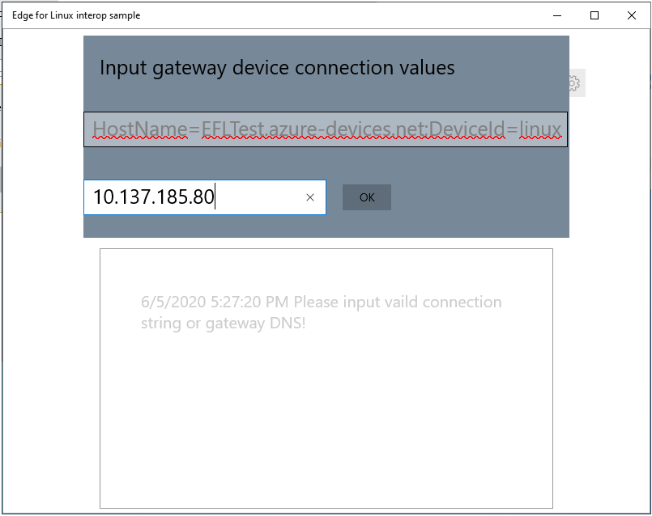
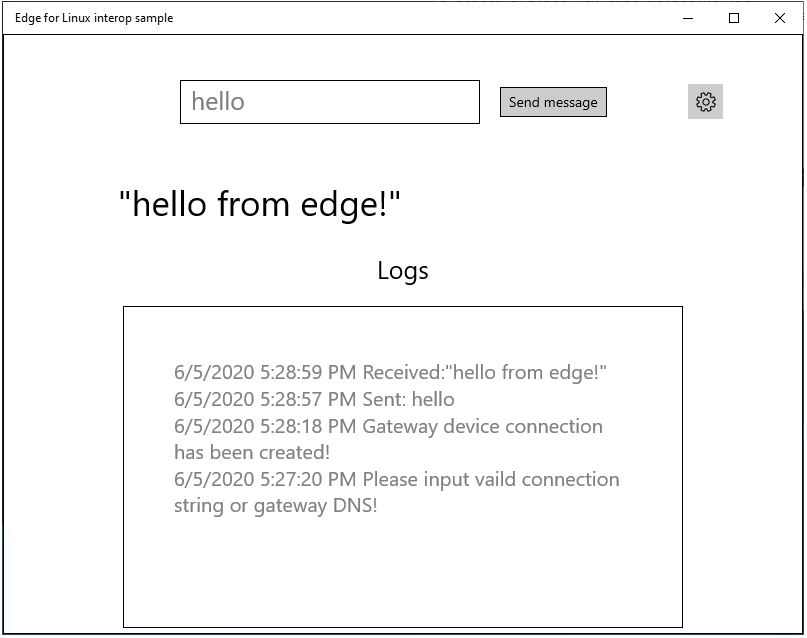
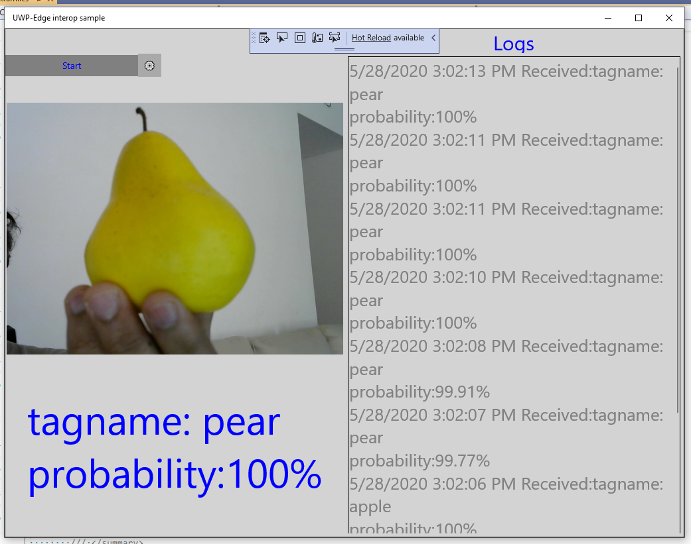
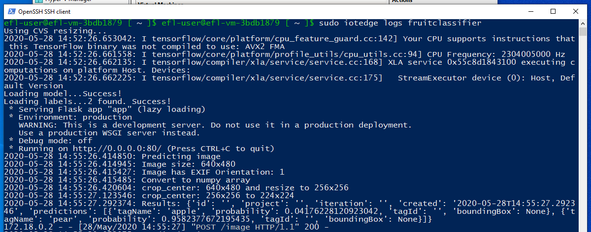

# Text Messaging & Custom Vision Interop Samples

This document uses two samples to demonstrate how Windows applicatons interoperate with Azure IoT Edge for Linux modules in a Linux environment.

1. **Simple Text Messaging**
  Demonstrates minimalistic text message exchange between a Windows application and an Azure IoT Edge for Linux module.

2. **Custom Vision**
   Demonstrates machine learning modules in Azure IoT Edge for Linux in which a Windows application sends camera frames to a Linux module and receives back a description of an item presented to the camera.

This document is structured around the activities required to build and run the samples, including:

- [Steps in the Azure IoT Portal](./readme.md#Steps-in-the-Azure-IoT-Portal)
- [Development environment setup](./readme.md#Development-environment-setup)
- [Steps in the Windows OS on the IoT Device](./readme.md#Steps-in-the-Windows-OS-on-the-IoT-Device)
- [Steps in the Linux environment on the IoT Device](./readme.md#Steps-in-the-Linux-environment-on-the-IoT-Device)
- [Steps to run the Showcase](./readme.md#Steps-to-run-the-Showcase)


**Prerequisites**
- An Azure subscription.
- Basic knowledge of the Azure Cloud portal and its use
- Setup of Azure IoT Edge for Linux on Windows

   - Either via WSL 2, see [Internet of Things Blog](https://aka.ms/winiot-low)) or
   - via manually setting up a Linux VM (e.g. Ubuntu) and deploying the azure-iotedge package, see for instance [Install the Azure IoT Edge runtime on Debian-based Linux systems](https://docs.microsoft.com/en-us/azure/iot-edge/how-to-install-iot-edge-linux)

- Windows 10 PC with PowerShell to set up an Azure Virtual Machine as your development environment.
- Text Messaging
  - A physical/emulated Windows host device.
- Custom Vision based on [Tutorial: Perform image classification at the edge with Custom Vision Service](https://docs.microsoft.com/azure/iot-edge/tutorial-deploy-custom-vision)
   - A physical Windows host device with a USB Camera connected.
   - Fruits for object classification.


## Steps in the Azure IoT Portal

Our showcase uses a configuration in the Azure IoT Portal with a sample *IoT Hub*, *IoT Edge Device*, *IoT Downstream Device*, and *IoT Deployment*. This configuration can be set up by executing the following commands in the [Azure Cloud Shell](https://docs.microsoft.com/azure/cloud-shell/features). An alternative is using PowerShell with the [Azure PowerShell Module Az](https://docs.microsoft.com/powershell/azure/install-az-ps).

- The *IoT Hub* is the cloud-based hub instance that controls our edge device that runs Azure IoT Edge instance.
- The *IoT Edge Device* represents the virtual device that runs the Azure IoT Edge for Linux instance (on Windows).
- The *IoT Downstream Device* represents our Windows application that communicates with the Linux module.
- The *IoT Deployment* specifies which modules are being deployed onto the IoT Edge Device.

Execute the following instructions:
- If using the PowerShell Az module, load the Az PowerShell module:

   - The following command is required if the PowerShell execution policy disallows module loading.

       ```
       powershell -ExecutionPolicy Bypass
       ```

   - The following command is required if the module is not imported by default.

      ```
      Import-Module Az
      ```

- Sign into the Azure Portal with this session only.

    ```
    Connect-AzAccount
    ```

   To persist sign ins across PowerShell sessions see [Azure PowerShell context objects](https://docs.microsoft.com/powershell/azure/install-az-ps)


- Use the following command to retrieve a list of subscriptions along with their UUID you are enrolled to.
   ```
   Get-AzSubscription
   ```

- Use the the following command to set a preferred subscription for creating the following steps.
   ```
   Set-AzContext -SubscriptionId "<UUID>"
   ```

- *Optional:* Create a resource group using [New-AzResourceGroup](https://docs.microsoft.com/azure/iot-hub/iot-hub-create-using-powershell#create-a-resource-group). You might decide to skip this step and be able to use an existing resource group. Ensure to select a suitable subscription under which to create a resource group (make sure you have a subscription that allows you creating resource groups).

   ```
   New-AzResourceGroup -Name InteropSampleRG -Location "West US"
   ```

   Use the following command to verify that the resource group has been created under your subscription.
   ```
   Get-AzResourceGroup
   ```

- *Optional:* Create an IoT Hub in a specific resource group using [NewAzIoTHub](https://docs.microsoft.com/azure/iot-hub/iot-hub-create-using-powershell#create-an-iot-hub).

   ```
   New-AzIotHub -ResourceGroupName InteropSampleRG -Name InteropSampleIoTHub -SkuName S1 -Units 1 -Location "West US"
   ```

- Create an IoT Edge Device, using [Add-AzIoTHubDevice](https://docs.microsoft.com/powershell/module/az.iothub/add-aziothubdevice)

   ```
   Add-AzIoTHubDevice -ResourceGroupName InteropSampleRG -IoTHubName InteropSampleIoTHub -DeviceId InteropSampleEdgeDev -EdgeEnabled
   ```

- Create an IoT Downstream Device with the IoT Edge Device as parent using [Add-AzIoTHubDevice](https://docs.microsoft.com/powershell/module/az.iothub/add-aziothubdevice)

   ```
   Add-AzIoTHubDevice -ResourceGroupName InteropSampleRG -IoTHubName InteropSampleIoTHub -DeviceId InteropSampleLeafDev -ParentDeviceId InteropSampleEdgeDev
   ```

- Note down the connection strings for the IoT edge and leaf devices for use in later steps:

   ```
   Get-AzIotHubDCS -ResourceGroupName InteropSampleRG -IotHubName InteropSampleIoTHub -DeviceId InteropSampleEdgeDev -KeyType primary | fl *
   ```
   ```
   Get-AzIotHubDCS -ResourceGroupName InteropSampleRG -IotHubName InteropSampleIoTHub -DeviceId InteropSampleLeafDev -KeyType primary | fl *
   ```

- *Optional:* Create a registry for the modules part of this sample using [New-AzContainerRegistry](https://docs.microsoft.com/powershell/module/az.containerregistry/New-AzContainerRegistry) (or other suitable registry):

   ```
   New-AzContainerRegistry -ResourceGroupName InteropSampleRG -Name InteropSampleRegistry -Sku "Basic" -EnableAdminUser
   ```

## Development environment setup

In this part, we describe how to build the Windows application and the Linux modules, how to upload the latter to our Azure Registry, and how to add our sample deployment to our sample IoT Edge Device. These steps are executed in a separate Windows development environment, which is an Azure cloud VM we set up with the following steps. Note that the development environment can also be set up manually on a separate physical Windows development machine.
On a Windows device with PowerShell installed, follow these steps to create the Windows development cloud VM serving as build environment:

- Complete the following steps from [Tutorial: Set up an environment for machine learning on IoT Edge](https://docs.microsoft.com/azure/iot-edge/tutorial-machine-learning-edge-02-prepare-environment)
   - Set up the development VM
   - Connect to the development VM
   - Install Visual Studio Code extensions

- Log into the Azure cloud VM as described in the tutorial

   > **Note:**
   If you cannot connect to the VM via RDP, ensure RDP port 3389 is not blocked for the VM. Navigate to the Azure portal and investigate the incoming networking rules. Allowing RDP through 53389 can provide immediate mitigation. There are three steps to change the RDP port. To follow these steps, open the Azure portal and navigate to your virtual machine.
   > 1. Go to 'Run command'. Run the command 'SetRDPPort 53389'.
   > 2. Go to 'Networking' and add an inbound port rule, allowing port 53389.
   > 3. Go to 'Connect' select 'RDP' and change the port number to 53389. Download the generated RDP file.

- For building the Windows application, install [Visual Studio 2019](https://visualstudio.microsoft.com/downloads/) with the Universal Windows Platform workload. The community edition is sufficient.

- Clone our interop sample code from GitHub in the VM:

   ```
   git clone https://github.com/microsoft/Windows-IoT-Samples.git
   ```

You are now all set to build the Linux modules and the Windows application in the cloud VM.

Build the sample Linux modules in VS Code and add them to your Azure Registry (we created the registry optionally in [Steps in the Azure IoT Portal](.readme.md#Steps-in-the-Azure-IoT-Portal)):

- Open VS Code as an administrator

- Open the below folder in VS Code based on the sample you are running:

  Text Messaging
  ` Windows-IoT-Samples\interop-customvision-textmsg-uwpapp\textmsg-uwpapp`

  Custom Vision
    `Windows-IoT-Samples\interop-customvision-textmsg-uwpapp\customvision`

- Create a **.env** file in this folder with the container registry authentication details as variables:

   ```
   CONTAINER_REGISTRY_USERNAME_partnercontainerregistry=XXX
   CONTAINER_REGISTRY_PASSWORD_partnercontainerregistry=XXX
   ```

- Replace the two 'XXX' in the .env file by setting the username and password for your container registry as found in the Azure Portal (navigate to your container registry in the Azure Portal and go to the tab 'Access Keys').

- Replace all occurrences of 'partnercontainerregistry' in the already opened folder with the your own registry's name in lower case letters, e.g., with 'interopsampleregistry' if you called your registry that way (using VS Code, you can press CTRL+SHIFT+F to search and replace all occurrences).

- Ensure to be logged in to the Azure Portal. VS Code will query you to do so.

- Ensure the docker daemon is running, if not please start it.

- Also ensure to be logged in with the Azure Registry itself using the credentials shown in the Azure Portal:

   ```
   docker login interopsampleregistry.azurecr.io
   ```

- Right click on the *deployment.template.json* file, click on *Build & push module*

Create an IoT Deployment containing the Linux modules and add it to our sample IoT Edge Device:

- This means to deploy the deployment manifest i.e. deployment.template.json onto your IoT Edge device.

- Using VS code, follow the steps from the documentation [Deploy Azure IoT Edge modules from Visual Studio Code](https://docs.microsoft.com/azure/iot-edge/how-to-deploy-modules-vscode): Choose your subscription, IoT Hub, right-click on the Edge Device and select 'Create Deployment for Single Device'. Select the file 'deployment.amd64.json' in the folder 'config' to push the deployment manifest.

Build sample certificates for the authentication between the Windows app and Linux module

- The following tutorial [Create certificates](https://docs.microsoft.com/en-us/azure/iot-edge/tutorial-machine-learning-edge-05-configure-edge-device#create-certificates) provides instructions on how to create a sample PKI with certificate validity for one month. You only need to generate certificates and do not need to upload them to Azure Key Vault.

- Following the instructions, you generate certificates with default subject name "turbofanGateway" and 30 days of validity. To extend the validity of certificates (or) to change the subject name, make the following modifications and re-build the docker image after that:

  - To extend the certificate validity to 365 days, replace `RUN yum -y install openssl git \` with `RUN yum -y install openssl git sed \`. Add following extra lines after `&& chmod 700 startup.sh`: `RUN sed -i -e '/days_till_expire/s/30/365/' certGen.sh`
  - To customize the subject name, add the following line before `ENTRYPOINT [ "/work/startup.sh" ]`: `RUN sed -i -e 's/turbofanGateway/sampleedgedevice/' startup.sh`

- You can also use your own root CA certificate in case you have a (test) PKI for downstream devices and edge devices.

- Copy the above generated sample PKI certificates i.e. private key 'new-edge-device.key.pem', certificate chain 'new-edge-device-full-chain.cert.pem', root CA cert 'azure-iot-test-only.root.ca.cert.pem' for authenticating the IoT Edge Device to the folder 'C:\certs' for future use.

Build the Windows application as an [application package in Visual Studio](https://docs.microsoft.com/windows/msix/package/packaging-uwp-apps):

- Open the below Windows application based on the sample you are running.

   Text Messaging
   `Windows-IoT-Samples\interop-customvision-textmsg-uwpapp\textmsg-uwpapp\LeafDeviceUWPApp\LeafDeviceUWPApp.sln`

   Custom Vision
   `Windows-IoT-Samples\interop-customvision-textmsg-uwpapp\customvision\DeviceCustomVisionUWPApp\DeviceCustomVisionUWPApp.sln`

- On the top pane, set build to 'Debug' and select the 'x64' architecture, and build the project.

- To be able to run the application on the Windows IoT device, build the application as an 'App package' according to [Package a desktop or UWP app in Visual Studio](https://docs.microsoft.com/windows/msix/package/packaging-uwp-apps)

   > **Note:**
   > Select sideloading without automatic updates
   > You will be prompted to create a certificate. As this is a test setup, you can create the test certificates for which VS offers an option in the process

- The output path for UWP package can be found in the below location.

   Text Messaging
   `Windows-IoT-Samples\interop-customvision-textmsg-uwpapp\textmsg-uwpapp\LeafDeviceUWPApp\AppPackages\LeafDeviceUWPApp_1.0.0.0_Debug_Test`

   Custom Vision
   `Windows-IoT-Samples\interop-customvision-textmsg-uwpapp\customvision\DeviceCustomVisionUWPApp\AppPackages\DeviceCustomVisionUWPApp _1.0.0.0_Debug_Test`

## Steps in the Windows OS on the IoT Device

The Windows IoT device hosting the Linux environment requires the Windows interop application binary, and must provide the Azure IoT Edge runtime in the Linux environment with the private key, certificate chain and root CA certificate such that the IoT Edge Device can communicate with the downstream device (aka Windows application).

- Copy the output Windows sample application package built in the previous step in the Windows cloud VM to this Windows IoT device

- Install the Windows application's dependencies. The Windows host may lack dependencies that are found in the below folders - install of each of these.

   Text Messaging
   `Windows-IoT-Samples\interop-customvision-textmsg-uwpapp\textmsg-uwpapp\LeafDeviceUWPApp\AppPackages\LeafDeviceUWPApp_1.0.0.0_Debug_Test\Dependencies`

   Custom Vision
   `Windows-IoT-Samples\interop-customvision-textmsg-uwpapp\customvision\DeviceCustomVisionUWPApp\AppPackages\DeviceCustomVisionUWPApp_1.0.0.0_Debug_Test\Dependencies`

- Install the signing certificate for the Windows sample application from the 'package' folder. Install the certificate to your local machine into the 'Trusted Root' store. This ensures that Windows will install and execute the application binary.

- Install the MSIX bundle in the application package folder (a file called as below based on the running sample). The app can now be found on the system, as...
   - Text Messaging: **azure iot edge for windows on Linux interop sample**
   - Custom Vision:  **UWP - Edge interop**

- In the next steps we copy the sample certificates to the Linux environment. Copy the private key, certificate chain, root CA cert for authenticating the IoT Edge Device from the development VM to this Windows IoT device ('new-edge-device.key.pem', 'new-edge-device-full-chain.cert.pem', 'azure-iot-test-only.root.ca.cert.pem') to the '~/certs' folder in the Linux environment.

  - WSL2: Copy the files, for instance, via accessing the Linux filesystem through the patch '\\wsl$' in File Explorer

  - Linux VM: Use SSH to create a folder in the Linux environment and scp to copy the private key, certificate chain, and root CA cert:
    ```
    ssh <username>@<VM IP/hostname> mkdir -p ~/certs
    scp .\certs\* <username>@<VM IP Address>:~/certs/
    ```

## Steps in Linux environment on the IoT Device

This subsection describes the configuration and provisioning steps for the Linux environment that are specific to our showcase. We make the following changes to the system and Azure IoT Edge configuration:

- Log in to the Linux environment
  - WSL2: Follow the [blog post](https://aka.ms/winiot-low) to change into the WSL environment
  - Linux VM: Use SSH to log in to the Linux environment
    ```
    ssh <username>@<VM IP address>
    ```

- Set up the Linux firewall for the interop of the Windows application and Linux module. As the Azure Device Client Namespace is used, we use the underlying AMQP protocol for the exchange of messages. We need to specifically allow incoming packets on the ports required by the AMQP protocol. We thus adapt the firewall rules as follows and persist them across reboots:

   ```
   sudo iptables -A INPUT -p tcp --dport 443 -j ACCEPT
   sudo iptables -A INPUT -p tcp --dport 5671 -j ACCEPT
   sudo iptables-save | sudo tee /etc/systemd/scripts/ip4save > /dev/null
   ```

- Run the following command to allow Azure IoT Edge to read the certificates.
   ```
   sudo chown -R iotedge: ~/certs
   ```

- Provision the Azure IoT Edge for Linux configuration:

   - Run the following command to start editing the config file.
      ```
      sudo nano /etc/iotedge/config.yaml
      ```

   - Set the connection string for the IoT Edge Device (queried previously, see [Steps in the Azure IoT Portal](./readme.md#Steps-in-the-Azure-IoT-Portal)). Edit the following part in the configuration file:

      ```
      # Manual provisioning configuration
      provisioning:
      source: "manual"
      device_connection_string: "<IoT Edge Device connection string>"
      ```

   - Enable the following lines to enable using the private key, certificate chain and root CA certificate required for the authenticated communication with the downstream device. This 'configures the edge device to act as a gateway'. The keys were previously deployed onto the Linux environment, see [Steps in the Windows IoT device](./readme.md#Steps-in-the-Windows-IoT-device).

      ```
      certificates:
      device_ca_cert: "/home/efl-user/certs/new-edge-device-full-chain.cert.pem"

      device_ca_pk: "/home/efl-user/certs/new-edge-device.key.pem"

      trusted_ca_certs: "/home/efl-user/certs/azure-iot-test-only.root.ca.cert.pem"
      ```

   - If you are on a network with dynamic DNS, then edge modules will automatically be able to resolve the VM's IP address from its hostname. If you are on a network without dynamic DNS, you will need to assign the VM a static IP address and change the line 'hostname: "..."' to 'hostname: "<VM IP Address>"'

   - Save and exit nano: press **CTRL+x**, confirm save and exit with **Y** and press **Enter**.

- Restart the iotedge service by running the below command.

   ```
   sudo systemctl restart iotedge
   ```

- Check whether iotedge is configured correctly by running the below command. If you find any errors, please refer to the tutorial [Troubleshoot your IoT Edge device](https://docs.microsoft.com/en-us/azure/iot-edge/troubleshoot) to troubleshoot.

   ```
   sudo iotedge check
   ```

## Steps to run the Showcase

Having restarted the 'iotedge' service and verified that iotedge is configured correctly, wait until the sample modules are pulled from the IoT Hub. Once the modules are running, the sample setup is ready to take messages from our Windows application.

### For text messaging interop:

- Run the application 'azure iot edge for windows in linux interop sample' and use its GUI to send messages to the Linux module. In this revision, the Windows application runs natively on the Windows IoT device and is note isolated inside a container.

- Right click on the app, it would prompt for connection string and gateway DNS name. Please enter the leaf device connection string that you have captured above and the Linux environment's IP address as gateway device. The logs show whether the connection was established successfully.

    

- Please enter a message such as "hello" and click on "Send message"
- The logs will show that you have sent the message and received a reply "hello from edge" from the Linux module.

   

- Use the following commands in the Linux environment to see messages passed from the Windows application to the Linux module.

   ```
   sudo iotedge logs processingmodule
   sudo iotedge logs proxyModule
   ```

### For custom vision sample interop:
- Run the application 'UWP-Edge interop sample' and use its GUI to send messages to the Linux module.
- In this revision, the Windows application runs natively on the Windows IoT device and is note isolated inside a container.
- Right click on the app, it would prompt for connection string and gateway DNS name. Please enter the leaf device connection string that you have captured above and Linux environment IP address as gateway device. You would see the logs that the connection established successfully.
- Click on "Start", it will start sending the image frames over to the IoT edge module.
- Please show "apple fruit" against the camera. The app would display the probability of the object classification at the bottom of the camera preview.

  

- Use the command `sudo iotedge logs processingmodule`, `sudo iotedge logs proxymodule`, `sudo iotedge logs fruitclassifier` in the Linux environment to see the messages passed from the Windows application to the Linux module.

   proxymodule logs:
   

   processingmodule logs:
   

   fruitclassifier module logs:
   
